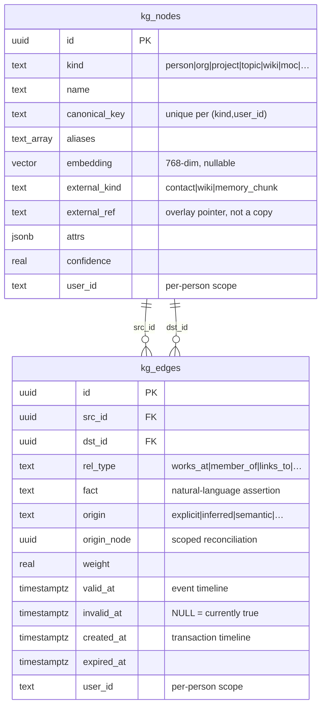

# Knowledge Graph

A typed, bitemporal knowledge graph layered over Nomos's vector memory. People, projects,
topics, and the relationships between them become first-class **nodes** and **edges** the
agent can traverse, reason over, and visualize — instead of being buried as free text inside
embeddings.

## Overview

Vector search is great for fuzzy recall ("what did we say about the launch?") but it can't
answer relational questions ("who do I know at Acme, and what's pending with them?") in one
hop. The knowledge graph is an **overlay** on the existing memory: it doesn't replace
`memory_chunks`, the [knowledge wiki](knowledge-wiki.md), or the `user_model` — it promotes
the relationships those already imply into a queryable graph.

- **Relationship-aware recall** — multi-hop questions answered by graph traversal.
- **Self-correcting memory** — when a fact changes, the old edge is _invalidated, not
  deleted_, so you can ask "what was true before?"
- **A navigable map** — a force-directed graph view of everything Nomos knows about your world.

The graph fills itself automatically from your conversations (no extra LLM calls for edge
extraction) and from your existing contacts and wiki.

## Architecture

The graph sits between the existing memory write path and every surface that reads it.
Writes are async and off the user-latency path; reads are recursive CTEs, always scoped to
one person.

```mermaid
flowchart TB
    subgraph SRC["Sources"]
        CONV["Conversation turns<br/>(daemon memory-indexer)"]
        CONTACTS["contacts /<br/>contact_identities"]
        WIKI["wiki_articles"]
    end

    subgraph WRITE["Write path · async, zero new LLM calls"]
        EXT["extractor.ts<br/>facts + entities (already runs)"]
        GW["graph-writer.ts"]
        QG{"quality gate<br/>reject low-conf / noise"}
        ER["entity resolution<br/>contacts + canonical_key"]
        VP["verb-pattern edges"]
        CC["contradiction check<br/>Haiku · single-valued rels"]
    end

    subgraph STORE["Knowledge graph · Postgres + pgvector"]
        NODES[("kg_nodes<br/>typed entities + embedding")]
        EDGES[("kg_edges<br/>typed · bitemporal · provenance")]
    end

    subgraph BG["Background jobs"]
        SEM["semantic-edge materializer<br/>pgvector cosine"]
        WS["wiki sync<br/>&#91;&#91;links&#93;&#93; + MOC hubs"]
    end

    GRAPH["graph.ts · recursive CTEs<br/>neighborhood · path · trajectory · as-of<br/>(user_id scoped at every hop)"]

    subgraph SURF["Surfaces"]
        AGENT["Agent · graph_* MCP tools"]
        SEARCH["hybrid search fusion<br/>3rd RRF signal"]
        REPL["REPL · /graph"]
        CLI["CLI · nomos brain"]
        VIZ["Web viz · /admin/graph<br/>+ JSON Canvas"]
        MOBILE["Mobile · gRPC Brain tab"]
    end

    CONV --> EXT --> GW --> QG --> ER
    ER --> NODES
    ER --> VP --> EDGES
    VP --> CC
    CC -. invalidate old .-> EDGES
    CONTACTS -. backfill .-> NODES
    WIKI -. backfill .-> NODES
    WS --> EDGES
    SEM --> EDGES
    NODES -. external_ref .-> CONTACTS
    NODES -. external_ref .-> WIKI

    NODES --> GRAPH
    EDGES --> GRAPH
    GRAPH --> AGENT & SEARCH & REPL & CLI & VIZ & MOBILE

    classDef store fill:#1e1e2e,stroke:#cba6f7,color:#cdd6f4;
    classDef surf fill:#1e1e2e,stroke:#89b4fa,color:#cdd6f4;
    class NODES,EDGES store;
    class AGENT,SEARCH,REPL,CLI,VIZ,MOBILE surf;
```



## Concepts

**Nodes** are typed entities. The starting kinds are `person`, `org`, `project`, `topic`,
`decision`, `value`, `event`, `wiki`, `moc` (map-of-content hub), and `chunk`. A node may be
a thin overlay over an existing row (a contact, a wiki article) via `external_kind` +
`external_ref` rather than duplicating it.

**Edges** are typed, directed relationships (`works_at`, `member_of`, `links_to`, `part_of`,
`related_to`, `mentions`, `prefers`, `scheduled_with`, `semantic_sibling`, … plus a free-form
fallback). Every edge carries:

- **provenance** — `origin` (`explicit` | `inferred` | `frontmatter` | `body` | `semantic` |
  `manual` | `mentions`) and `source_ids` back to the memory chunks that created it.
- **bitemporal validity** — `valid_at`/`invalid_at` (when the fact is/was true in the world)
  and `created_at`/`expired_at` (when the system learned/retracted it). Current state is
  simply `WHERE invalid_at IS NULL`.

## Schema

Two tables, idempotently migrated alongside the rest of the schema. Requires the `pg_trgm`
extension (enabled automatically by `nomos db migrate`).



### `kg_nodes`

| Column                           | Type        | Description                                                  |
| -------------------------------- | ----------- | ------------------------------------------------------------ |
| `kind`                           | TEXT        | `person` \| `org` \| `project` \| `topic` \| `wiki` \| …     |
| `name`                           | TEXT        | Display name                                                 |
| `canonical_key`                  | TEXT        | Normalized dedup key (unique per `kind`, `user_id`)          |
| `aliases`                        | TEXT[]      | Cross-channel / nickname resolution                          |
| `summary`                        | TEXT        | Optional one-liner                                           |
| `embedding`                      | vector(768) | `gemini-embedding-001`; powers semantic edges + search       |
| `external_kind` / `external_ref` | TEXT        | Overlay pointer to a `contact` / `wiki` / `memory_chunk` row |
| `attrs`                          | JSONB       | Folded attributes (e.g. phone, email)                        |
| `confidence`                     | REAL        | 0–1                                                          |
| `user_id`                        | TEXT        | Per-person scope (default `local`)                           |

### `kg_edges`

| Column                      | Type        | Description                                    |
| --------------------------- | ----------- | ---------------------------------------------- |
| `src_id` / `dst_id`         | UUID        | Endpoints (FK to `kg_nodes`)                   |
| `rel_type`                  | TEXT        | Typed predicate                                |
| `fact`                      | TEXT        | Natural-language assertion (provenance)        |
| `origin` / `origin_node`    | TEXT / UUID | Provenance + scoped-reconciliation key         |
| `weight`                    | REAL        | e.g. cosine score for semantic edges           |
| `valid_at` / `invalid_at`   | TIMESTAMPTZ | Event timeline (when true in the world)        |
| `created_at` / `expired_at` | TIMESTAMPTZ | Transaction timeline (when the system knew it) |
| `confidence`                | REAL        | 0–1                                            |
| `user_id`                   | TEXT        | Per-person scope                               |

Traversal uses Postgres **recursive CTEs** with a hard depth cap and a visited-set — no
Apache AGE, no GraphQL, no second engine. Suitable for the hundreds-to-thousands of nodes a
personal brain produces.

## How the graph fills

### 1. Backfill (existing data)

```bash
nomos brain backfill
```

Promotes, idempotently: `contacts` → `person` nodes, `contact_identities` → aliases,
`wiki_articles` → `wiki` nodes, wiki `backlinks` and inline `[[wikilinks]]` → `links_to`
edges, and wiki categories → `moc` topic hubs with `part_of` edges.

### 2. Conversations (self-wiring, zero new LLM calls)

When `NOMOS_ADAPTIVE_MEMORY=true`, the daemon's memory indexer already extracts structured
facts from each turn. The graph writer turns those into nodes/edges with **no extra model
call**: relationship types come from regex verb-patterns ("works at" → `works_at`), people
resolve through `contacts`, and contact details (phone/email) are folded onto the node as
attributes rather than becoming their own nodes.

A **quality gate** runs _before_ any write: low-confidence facts, pure numbers/dates, and
noise are rejected, and idempotent upserts (unique keys + `GREATEST(confidence)`) bound
amplification so a repeated extraction can't fan out into duplicate rows.

### 3. Wiki (zero-LLM links)

Whenever the [knowledge wiki](knowledge-wiki.md) recompiles, inline `[[wikilinks]]` are wired
into `links_to` edges and categories into MOC hubs, reconciled per-article.

## Querying the graph

### Agent (in-process MCP tools)

The agent gets five narrow tools (registered next to `memory_search`):

| Tool                | Purpose                                                            |
| ------------------- | ------------------------------------------------------------------ |
| `graph_search`      | Resolve a name → node(s) + 1-hop neighborhood (trigram + cosine)   |
| `graph_neighbors`   | Depth-bounded ego-network (the core relationship-recall primitive) |
| `graph_path`        | Shortest typed path between two entities                           |
| `graph_history`     | How a single-valued relationship changed over time                 |
| `graph_upsert_edge` | Let the agent record a durable relationship                        |

`graph_neighbors` also accepts `as_of` for point-in-time queries ("what was true on DATE").

### Hybrid search fusion

When a query resolves to a known entity, its 1-hop relationships are folded into
`memory_search` as a **third RRF signal** alongside vector and full-text — so ordinary recall
becomes relationship-aware. Graph-sourced results are tagged `source: "graph"`.

### CLI

```bash
nomos brain stats              # node/edge counts by kind and relation
nomos brain search "alice"     # resolve an entity by name
nomos brain semantic           # embed nodes + materialize semantic edges (needs embeddings)
nomos brain export "alice"     # export a local graph to a JSON Canvas (.canvas) file
```

### REPL slash command

```text
/graph            # whole-graph summary (counts by kind)
/graph alice      # a node's local graph: outgoing + incoming relationships
```

## Visualization

The Settings UI ships an Obsidian-style force-directed graph at **`/admin/graph`**:

- Local-Graph-first: click a node to zoom into its depth-bounded neighborhood.
- Color by node kind, filter by kind/relation, toggle semantic and superseded edges.
- Click-through to the underlying contact / wiki article / memory chunk.
- The renderer is a dependency-free HTML canvas (pan / zoom / drag / hover) — no heavy graph
  library. The page is a pure projection: a single endpoint emits `{nodes, links}`.

Subgraphs export to **[JSON Canvas](https://jsoncanvas.org/)** (`.canvas`), an open,
LLM-readable format that opens directly in Obsidian.

A read-only Brain tab is also exposed over gRPC (`MobileApi`) for the mobile client.

## Bitemporal facts

Single-valued relationships (e.g. `works_at`) trigger a scoped contradiction check: when a
new value arrives, a single lightweight model call decides whether it supersedes the existing
edge. If so, the old edge's `invalid_at` is set to the new edge's `valid_at` — **history is
preserved, never deleted**. This powers:

- `graph_history` — the supersession chain ("where has this person worked?").
- `as_of` queries — reconstruct the graph as it was believed at any past instant.

## Semantic edges

`nomos brain semantic` embeds nodes (name + summary) and materializes `semantic_sibling`
edges from pgvector cosine nearest-neighbors above a threshold (default 0.85, top-K capped so
the graph stays sparse). These render alongside explicit links and give "related-by-meaning"
traversal. Requires an embeddings provider (Vertex `gemini-embedding-001`); it no-ops
gracefully without one.

## Relationship to other systems

| System              | Holds                                       | Shape                       |
| ------------------- | ------------------------------------------- | --------------------------- |
| **Vector memory**   | Every conversation turn                     | Embedded chunks (RAG)       |
| **Knowledge wiki**  | Compiled articles about people/topics       | Structured markdown         |
| **User model**      | Your preferences/values/decision-patterns   | Always-in-context core      |
| **Knowledge graph** | Typed entities + relationships between them | Queryable, bitemporal graph |

They coexist: the graph references the others by id for provenance rather than duplicating
them.

## Configuration & requirements

| Requirement                  | For                                                  |
| ---------------------------- | ---------------------------------------------------- |
| `pg_trgm` extension          | Fuzzy name resolution (auto-enabled by `db migrate`) |
| `NOMOS_ADAPTIVE_MEMORY=true` | Auto-growing the graph from conversations            |
| Embeddings (Vertex)          | Semantic edges + embedding-ranked search (optional)  |

## Privacy

The graph is **per-person**: every node and edge carries a `user_id`, and every read —
including each hop of a recursive traversal and the visualization endpoint — is scoped to the
caller. Power-user installs run as a single local user; this is invisible there. The graph
adds no `org_id` column: organization isolation is the database boundary.

## Prior art

The design borrows established ideas: bitemporal, invalidate-don't-delete edges from
[Graphiti / Zep](https://github.com/getzep/graphiti); links, the local-graph view, and the
JSON Canvas format from [Obsidian](https://obsidian.md/); and self-wiring typed edges with
zero LLM calls from the gbrain project.

## Verifying it works

An end-to-end verification runbook (seed data, expected outputs, per-layer pass criteria)
lives with the project's internal docs. The quick check:

```bash
nomos db migrate && nomos brain backfill && nomos brain stats
```
